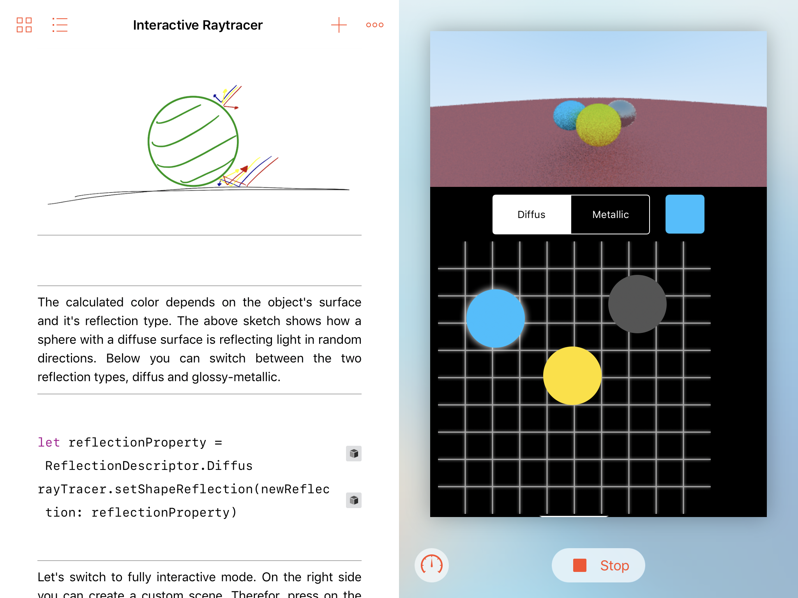
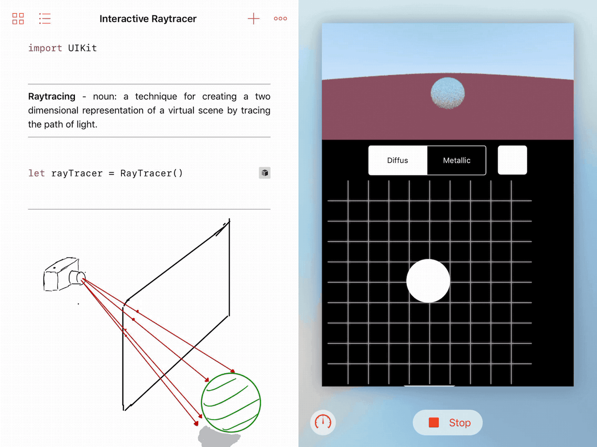
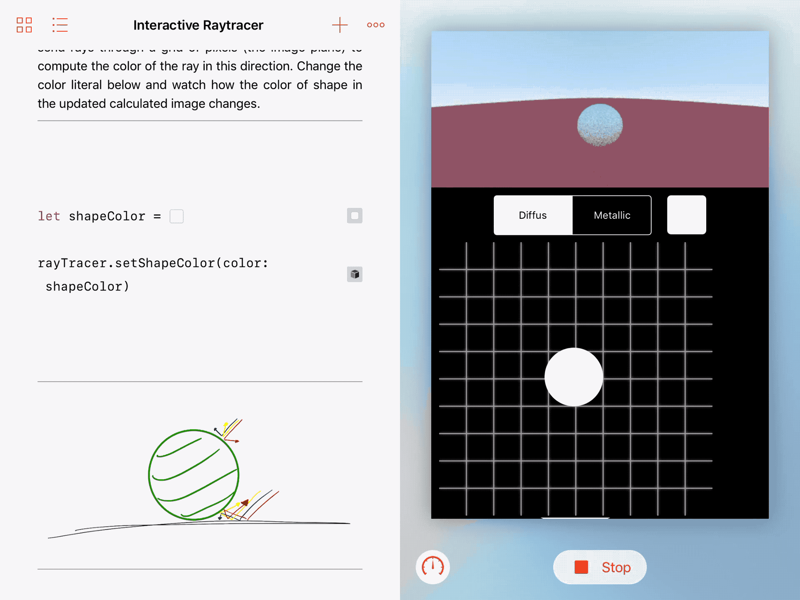

# WWDC Scholarship 2017: Swift Playground about Raytracing

A Swift playground about a basic raytracer, implementing diffus and metallic reflection on spheres.

***

***

### Credit
This project is based on **Peter Shirleys** implementation of a Raytracer in C++ from his book series [Ray Tracing Minibooks](https://www.amazon.com/Ray-Tracing-Weekend-Minibooks-Book-ebook/dp/B01B5AODD8/ref=sr_1_3?s=digital-text&ie=UTF8&qid=1504779962&sr=1-3&keywords=Ray+Tracing+Minibooks+Book)